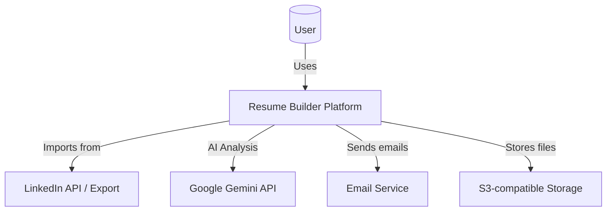
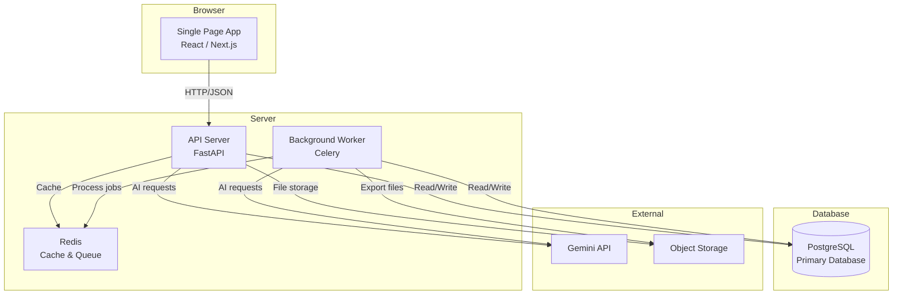
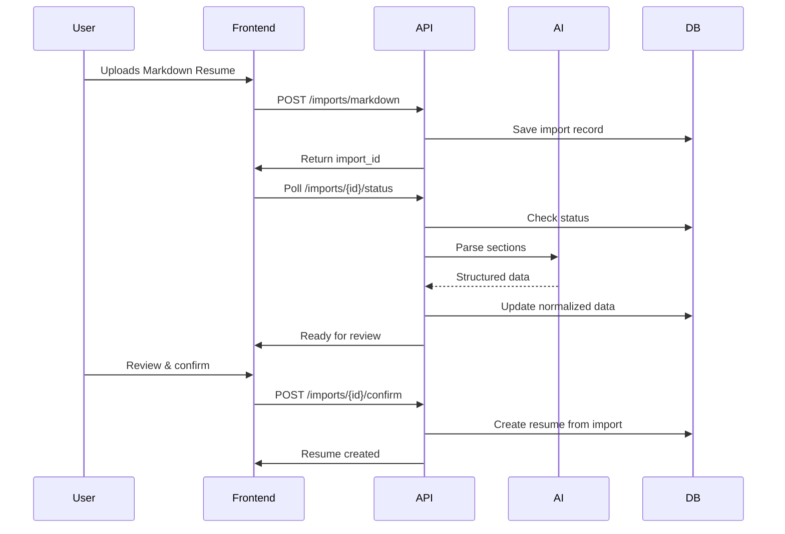

# Architecture

## System Context Diagram

```mermaid
graph TB
    User[("User")]
    ResumeBuilder["Resume Builder Platform"]
    LinkedIn["LinkedIn API / Export"]
    Gemini["Google Gemini API"]
    Email["Email Service"]
    S3["S3-compatible Storage"]

    User -->|Uses| ResumeBuilder
    ResumeBuilder -->|Imports from| LinkedIn
    ResumeBuilder -->|AI Analysis| Gemini
    ResumeBuilder -->|Sends emails| Email
    ResumeBuilder -->|Stores files| S3
```

## Container Diagram

```mermaid
graph TB
    subgraph "Browser"
        B["Single Page App\nReact / Next.js"]
    end
    subgraph "Server"
        API["API Server\nFastAPI"]
        W["Background Worker\nCelery"]
        R["Redis\nCache & Queue"]
    end
    subgraph "Database"
        PG[("PostgreSQL\nPrimary Database")]
    end
    subgraph "External"
        G["Gemini API"]
        OBJ["Object Storage"]
    end

    B -->|HTTP/JSON| API
    API -->|Read/Write| PG
    API -->|Cache| R
    API -->|AI requests| G
    API -->|File storage| OBJ
    W -->|Process jobs| R
    W -->|Read/Write| PG
    W -->|Export files| OBJ
    W -->|AI requests| G
```

## Data Flow

```mermaid
sequenceDiagram
    participant User
    participant Frontend
    participant API
    participant AI
    participant DB

    User->>Frontend: Uploads Markdown Resume
    Frontend->>API: POST /imports/markdown
    API->>DB: Save import record
    API->>Frontend: Return import_id
    Frontend->>API: Poll /imports/{id}/status
    API->>DB: Check status
    API->>AI: Parse sections
    AI-->>API: Structured data
    API->>DB: Update normalized data
    API->>Frontend: Ready for review
    User->>Frontend: Review & confirm
    Frontend->>API: POST /imports/{id}/confirm
    API->>DB: Create resume from import
    API->>Frontend: Resume created
```
