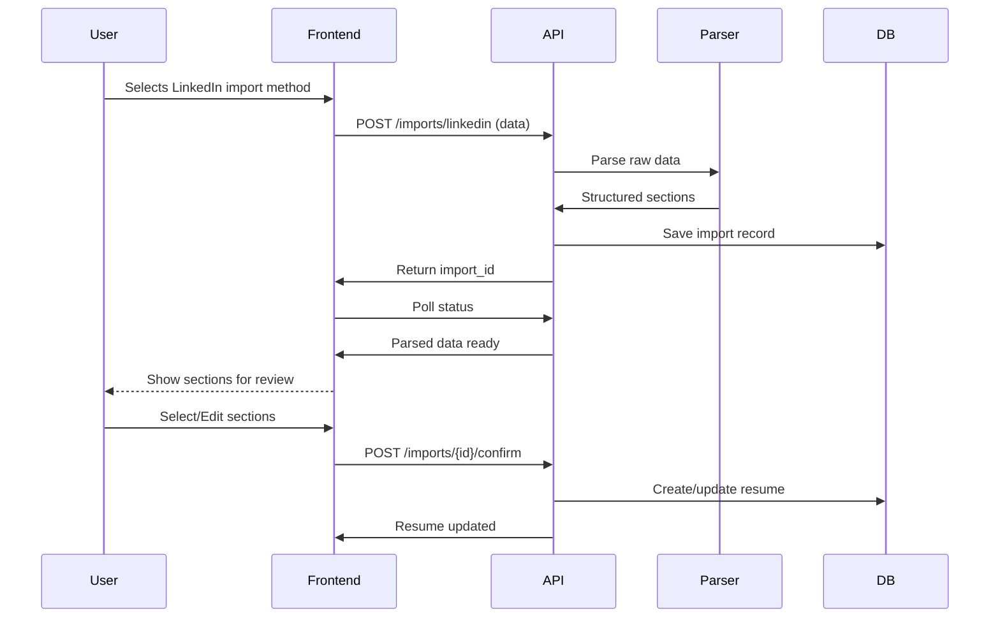

# LinkedIn Import

## Supported Methods

### 1. Manual Paste

Users can copy and paste text from their LinkedIn profile. The importer uses keyword-based section detection to parse:

- About/Summary
- Experience
- Education
- Skills
- Certifications
- Projects
- Languages
- Volunteer experience
- Publications
- Courses

### 2. LinkedIn Data Export

Users can upload their LinkedIn data export (ZIP file containing Profile data in JSON format).

To request your data export:
1. Go to LinkedIn Settings & Privacy
2. Data Privacy > Get a copy of your data
3. Select "Profile" and request archive
4. Download and upload the file

## Import Flow

## Review Process

Before saving, users can:

- View each detected section
- Select/deselect sections to import
- Edit individual fields
- Resolve duplicates with existing data
- Reject incorrect information
- Confirm dates and employment details

## Security & Compliance

- No unauthorized scraping of LinkedIn
- Data export import requires user to provide their own export
- All data reviewed before persisting
- Import consent explicitly requested
- Data can be deleted at any time
